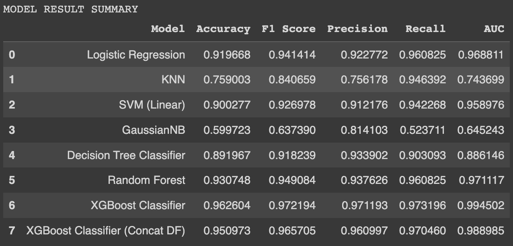
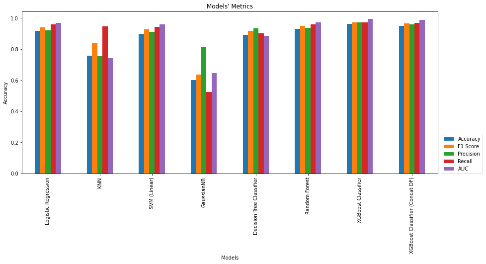
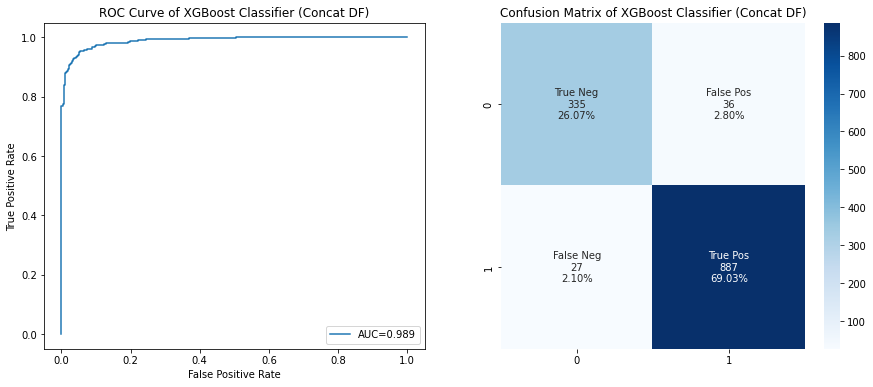
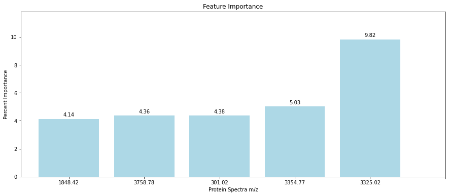

# COVID-19-Saliva-Testing
This project is a part of Chula UTC: AI Academy Batch 3 Entry Exam

# Model Result Summary

# Model Accuracy Comparison

# Best Model Result

# Feature Importance of XGBoost Model of Molecular Mass Retrieved by Mass Spectrometry

